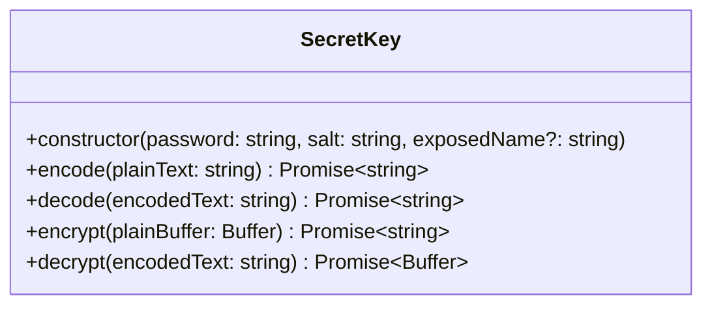

# electronade-endecoder-util

It's a package that provides some utilities for [electronade-endecoder](https://electronade-endecoder.netlify.app/).

It's an optional module for `electronade-endecoder` so `electronade-endecoder` should be installed before using `electronade-endecoder-util`.


[](https://www.npmjs.com/package/electronade-endecoder-util)

## installation
``` shell
npm install electronade-endecoder-util
```

## interfaces



``` typescript
import { SecretKey } from "electronade-endecoder-util";

const key = new SecretKey("password", "salt");
const plainText = "this is a test":

const encodedText = await key.encode(plainText);

assert.equal(
  await key.decode(encodedText),
  plainText
);
```
